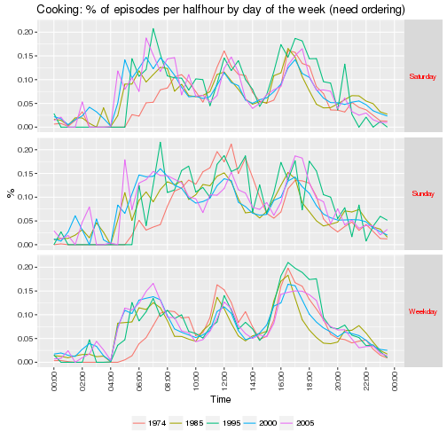
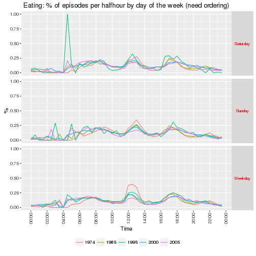

Abstract (original)

Aggregate energy demand follows strong repetitive patterns on multiple scales (day, week, seasons), due to social rhythms coordinating the synchronicity of consuming practices. These patterns are not only related to natural cycles that remain unchanged, but also to social structures and technology, that change over the years and across different geographical areas.
How do these changes and regional differences affect energy demand rhythms? Answering this question, would improve our understanding of demand flexibility and possible future evolutions.

In this research we study the energy footprint of practices which are widely shared, highly regular, and key markers of the social organisation: eating practices. Different types of meals and food preparation are described based on the quantitative data collected by the means of Time Use Surveys in France and in the United Kingdom. These practices are defined in terms of time, durations, primary, secondary and surrounding activities, participants, and places. The distribution of these practices are studied across several time scales (week days, seasons, and decades from 1974 to 2010) and areas (UK, France and French regions). The temporal and spatial variations of eating practices can then be compared with the energy demand measured by the power grids or in specific campaigns, and varying along the same axes. This comparison reveals how parts of the energy demand dynamic are related to specific practices and their synchronisation. Finally, the mechanism of this coevolution can be partly interpreted in the light of wider social and technical changes depicted in socio-economic and demographic series (employment structure, food consumption, home equipment).


```
## [1] "# Setting up R environment"
```

```
## [1] "Loading required packages:"
```

```
## [1] "ggplot2"    "data.table" "knitr"      "survey"
```

```
## [[1]]
## [1] TRUE
## 
## [[2]]
## [1] TRUE
## 
## [[3]]
## [1] TRUE
## 
## [[4]]
## [1] TRUE
```

# Introduction
Discussion of temporal nature of electricity demand, interest in peaks (reasons for this) and the ability to shift in general.

Recent work (DECC HES?) has highlighted the role of cooking (and subequently eating) in generating demand for electricity during the evening peak period (give times).

At the same time recent work (Southerton et al) has shown how the habits and practices of eating have changed over time in the UK anbd Spain. Although this work only provides an analysis of the duration of acts (episodes) it provides evidence of the ongoing evolution of eating habits which may have implications for cooking and thus for electricity/energy demand.

It is possible that 're-arranging' cooking habits may be one way to reduce the problematic evening peak electricity demand. However without a more detailed analysis of what kinds of eating (and especially cooking) are already changing and of the variation in cooking practices across the population, we have little idea where to start.

Digression on time use as a footprint/proxy for practices?

This paper uses natioanlly representative time use diary data form the United Kingdom and France to compare and contrast the changing timing of cooking and eating in each country over the last 30 years. It then uses the most recent data to analyse and comapre the social and spatial variation in current eating practices in each country. Finally the paper provides preliminary analysis of French regional residential electricity consumption data which highlights the role of regional variation in cooking practices. The paper concludes with a discussion of the implications of the results for electricity demand in the UK and France and outlines directions for future research

# Cooking, Eating and Energy
Here we need to talk about the changing nature of cooking & eating from the literature (if there is any) - quant (e.g. Southerton) & qual (e.g. Warde).

Need then to link it to energy consumption - in UK gas & electricity used for cooking, in France = electricity (mostly, but LPG?).

More detailed discussion of the problem of peak demand? - expensive/dirty generation?

 * energy implication of different preparations : cooking/not cooking, in different places, with different appliances
 * giving time : synchronising a number of other energy demanding practices -> peaks
	
 We then need to explain here how we come to discuss these meal types:

 * weekday lunch 
 * weekday dinner
 * sunday lunch
 
Should this come after a general exploration of the data? So that we can look at the timings and then explain why we concentrate on these 'practices'?

# Data
A relatively brief introduction to the time use diary data for each country:

 * years & sources
 * key collection/diary features
 * categories of activities & any coding issues/missing attributes

## United Kingdom (MTUS)


```
## [1] "# Load MTUS UK episodes data file"
```

```
## 
Read 60.1% of 1364047 rows
Read 96.8% of 1364047 rows
Read 1364047 rows and 17 (of 17) columns from 0.299 GB file in 00:00:04
```

```
##            ba_weekday
## r_dow       Saturday Sunday Weekday
##   Monday           0      0  181027
##   Tuesday          0      0  184177
##   Wednesday        0      0  173808
##   Thursday         0      0  178538
##   Friday           0      0  175762
##   Saturday    237527      0       0
##   Sunday           0 233208       0
```

```
## 
## 1974 1983 1987 1995 2000 2005 
## 2598 1350 1586 1962 8688 4854
```


Key codes in the MTUS:

 * meals at work or school = 5 (not available in all surveys)
 * meals or snacks in other places = 6
 * food preparation, cooking = 18
 * restaurant, cafe, bar, pub = 39 (but may not be eating?!)
 * out with friends could be eating = 48 (but check location as might also be at home)
 * eloc = location
 
Mention pooling 1983/4 & 1987 to form one '12 month' survey ref MTUS userguide p13

Report some basic (unweighted) descriptive statsitics of the sample we will use. 


|        | 1974| 1985| 1995| 2000| 2005| NA|
|:-------|----:|----:|----:|----:|----:|--:|
|(16,25] |  493|  496|  181| 1058|  384|  0|
|(25,35] |  552|  737|  411| 1675|  798|  0|
|(35,45] |  462|  612|  324| 1732|  911|  0|
|(45,55] |  527|  507|  312| 1630|  769|  0|
|(55,65] |  317|  356|  258| 1133|  812|  0|
|(65,75] |  180|  168|  306|  927|  633|  0|
|(75,85] |   54|   60|  169|  533|  547|  0|
|NA      |   13|    0|    1|    0|    0|  0|


|      | 1974| 1985| 1995| 2000| 2005| NA|
|:-----|----:|----:|----:|----:|----:|--:|
|Man   | 1239| 1291|  900| 3935| 2185|  0|
|Woman | 1359| 1645| 1062| 4753| 2669|  0|
|NA    |    0|    0|    0|    0|    0|  0|


## Cooking and eating episodes
Both cooking and eating could have been reported as main and secondary acts in all surveys except 1995 when secondary activities were not collected. For cooking we can see from the table below that the reporting of cooking as a secondary act was low in most surveys irrespective of gender. As it is never clear whether secondary activities are simply rare, under-reported or not completed due to respondent burden (XX reference XX) in the remainder of the chapter we will focus on cooking as a main activity only.


| Survey|Sex   | N episodes| Main (% of episodes)| Secondary (% of episodes)| Either (% of episodes)|
|------:|:-----|----------:|--------------------:|-------------------------:|----------------------:|
|   1974|Man   |       2581|                 2.08|                      0.44|                   2.52|
|   1974|Woman |      21871|                12.31|                      1.73|                  14.04|
|   1985|Man   |       8068|                 4.42|                      1.01|                   5.38|
|   1985|Woman |      27900|                 9.57|                      1.68|                  11.14|
|   1995|Man   |        867|                 7.27|                      0.00|                   7.27|
|   1995|Woman |       1881|                11.59|                      0.00|                  11.59|
|   2000|Man   |      11149|                 5.97|                      0.37|                   6.34|
|   2000|Woman |      26740|                 9.64|                      0.56|                  10.20|
|   2005|Man   |       2818|                 6.97|                      0.39|                   7.36|
|   2005|Woman |       5835|                10.49|                      0.57|                  11.06|

Similarly, eating is reported in between one and four percent of secondary activity episodes irrespective of gender (see below). As above, due to uncertainties over the intepretation of secondary activities we will focus on eating as a main activity only in the remainder of the chapter


| Survey|Sex   | N episodes| Main (% of episodes)| Secondary (% of episodes)| Either (% of episodes)|
|------:|:-----|----------:|--------------------:|-------------------------:|----------------------:|
|   1974|Man   |      17518|                14.14|                      3.39|                  17.48|
|   1974|Woman |      20371|                11.47|                      3.24|                  14.67|
|   1985|Man   |      23816|                13.04|                      4.09|                  16.76|
|   1985|Woman |      32871|                11.28|                      3.90|                  14.92|
|   1995|Man   |       1536|                12.88|                      0.00|                  12.88|
|   1995|Woman |       2047|                12.61|                      0.00|                  12.61|
|   2000|Man   |      25434|                13.62|                      3.88|                  17.11|
|   2000|Woman |      33249|                11.98|                      3.26|                  15.05|
|   2005|Man   |       4769|                11.80|                      1.09|                  12.89|
|   2005|Woman |       6269|                11.27|                      0.95|                  12.23|


## The distribution of cooking and eating as main activities in the UK 1974 - 2005


Having the established the overall unweighted distributions of eating and cooking, the following table shows the weighted proportion of episodes which were reported as cooking as a main activity by men and women in each survey. As can be seen the correction for non-response bias using the survey weights has adjusted the figures slightly. In general women report a far higher percentage of episodes as cooking/food preparation than men although the ratio has equalised somewhat from 0.1739489 in 1974 to 0.6515748 by 2005.


|Sex   | Survey| % episodes|  2.5%| 97.5%|
|:-----|------:|----------:|-----:|-----:|
|Man   |   1974|       2.11|  2.01|  2.22|
|Woman |   1974|      12.35| 12.18| 12.52|
|Man   |   1985|       4.40|  4.28|  4.53|
|Woman |   1985|       9.65|  9.53|  9.77|
|Man   |   1995|       7.17|  6.64|  7.69|
|Woman |   1995|      11.39| 10.87| 11.92|
|Man   |   2000|       5.96|  5.81|  6.12|
|Woman |   2000|       9.71|  9.57|  9.85|
|Man   |   2005|       6.62|  6.33|  6.91|
|Woman |   2005|      10.16|  9.89| 10.43|

In comparison, eating is reported far more equally (see below) with both men and women consistently reporting eating as a main activity in between 11 and 14 percent of episodes.


|Sex   | Survey| % episodes|  2.5%| 97.5%|
|:-----|------:|----------:|-----:|-----:|
|Man   |   1974|      14.05| 13.89| 14.22|
|Woman |   1974|      11.43| 11.30| 11.56|
|Man   |   1985|      12.90| 12.74| 13.05|
|Woman |   1985|      11.37| 11.25| 11.49|
|Man   |   1995|      12.75| 12.23| 13.27|
|Woman |   1995|      12.24| 11.81| 12.68|
|Man   |   2000|      13.68| 13.51| 13.84|
|Woman |   2000|      11.99| 11.85| 12.12|
|Man   |   2005|      11.48| 11.19| 11.76|
|Woman |   2005|      11.03| 10.79| 11.26|

However as the introiduction to this chapter explains, the concern here is less with gender inequalities per se but more with the porentially changing temporal distronution of cooking and eating and the role that gendered norms may play. The following chart shows the weighted distribution of cooking as a main activity across time of day and day of the week for the different surveys irrespective of gender.

XX Needs a sensible colour scheme XX



The following chart shows the distribution of eating across time of day and day of the week for the different surveys.



Brief discussion of our consequential interest in patterns of weekday lunch, weekday dinner and sunday lunch and discussion of how we code them in the MTUS:

 * Weekday lunch is coded as eating between 12:00 and 14:00 at any location on a week day
 * Dinner is coded as any eating 17:00 - 22:00
 * Sunday lunch is coded as any eating between 12:00 and 15:00 on Sundays

In the following we show the code used to identify these 'practices'. 


```r
# Need to create an hour variable from r_epStartTime to avoid losing all those  not set in r_epStartDateTime
mtusUKEpisodes_DT[, hour := as.POSIXlt(r_epStartTime)$hour]
mtusUKEpisodes_DT[, mins := as.POSIXlt(r_epStartTime)$min]

# flag weekday lunch
mtusUKEpisodes_DT[, weekdayLunch := ifelse(is_eating_m == 1 & hour >= 12 & hour <= 14 & 
                                             r_dow != "Saturday" & r_dow != "Sunday",
                                                      1, # is weekday lunch
                                                      0 # is not
                                                      )
                             ]
# check - should be weekdays only
table(mtusUKEpisodes_DT$weekdayLunch,
      mtusUKEpisodes_DT$r_dow,
      useNA = "always"
      )
```

```
##       
##        Monday Tuesday Wednesday Thursday Friday Saturday Sunday   <NA>
##   0    175672  178979    169003   173819 171045   237527 233208      0
##   1      5355    5198      4805     4719   4717        0      0      0
##   <NA>      0       0         0        0      0        0      0      0
```


```r
# flag dinner
mtusUKEpisodes_DT[, dinner := ifelse(is_eating_m == 1 & hour >= 17 & hour < 22,
                                                      1, # is dinner
                                                      0 # is not
                                                      )
                             ]
# check - should only be in the evening
table(mtusUKEpisodes_DT$hour,
      mtusUKEpisodes_DT$dinner,
      useNA = "always")
```

```
##       
##            0     1  <NA>
##   0    29169     0     0
##   1     9848     0     0
##   2     3570     0     0
##   3     2644     0     0
##   4    59002     0     0
##   5     8483     0     0
##   6    29871     0     0
##   7    74780     0     0
##   8    90107     0     0
##   9    78334     0     0
##   10   69065     0     0
##   11   57956     0     0
##   12   78537     0     0
##   13   80433     0     0
##   14   59944     0     0
##   15   57473     0     0
##   16   68879     0     0
##   17   69248 18271     0
##   18   72923 14743     0
##   19   67653  7625     0
##   20   59511  5358     0
##   21   52996  5310     0
##   22   71000     0     0
##   23   61314     0     0
##   <NA>     0     0     0
```


```r
# flag sunday lunch
mtusUKEpisodes_DT[, sundayLunch := ifelse(is_eating_m == 1 & hour >= 12 & hour <= 15 &
                                            r_dow == "Sunday",
                                          1, # is sunday lunch
                                          0 # is not
                                          )
                             ]
# check (should only be on Sunday)
table(mtusUKEpisodes_DT$sundayLunch,
      mtusUKEpisodes_DT$r_dow,
      useNA = "always"
      )
```

```
##       
##        Monday Tuesday Wednesday Thursday Friday Saturday Sunday   <NA>
##   0    181027  184177    173808   178538 175762   237527 224682      0
##   1         0       0         0        0      0        0   8526      0
##   <NA>      0       0         0        0      0        0      0      0
```

The following table summrises the prevalence of these 'eating practices' in the different surveys.


| ba_survey| Weekday lunch| Dinner| Sunday lunch|
|---------:|-------------:|------:|------------:|
|      1974|          2.88|   3.70|         0.54|
|      1985|          1.67|   3.59|         0.49|
|      1995|          1.70|   4.42|         0.49|
|      2000|          1.38|   3.94|         0.87|
|      2005|          1.36|   3.77|         0.43|

Finally, in order to control for the potentially different levels of reporting due to the different diary slot durations, we calculate an indicator which is 1 if at least one epsiode in a given half hour is reported to be the activity of interest and 0 otherwise. In the case of the 1974 data where the diary slot duration was 30 minutes there will be no difference. However in the case of the other diaries where data was collected in slots of 15 minutes (1983, 1987, 1995) or 10 minutes (2000/1, 2005) duration, this will have the effect of increasing the apparent rate as the denominator is no longer the sum of all episodes in the half hour but the (lower) number of half hours.

The tables below show the distribution of these indicators across years.


| ba_survey| Cooking (mean n episodes per halfhour)| Cooking (max episodes per hh)| Cooking (% 'at least 1')|
|---------:|--------------------------------------:|-----------------------------:|------------------------:|
|      1974|                                   0.08|                             1|                     8.39|
|      1985|                                   0.09|                             6|                     8.69|
|      1995|                                   0.10|                             1|                    10.25|
|      2000|                                   0.11|                             3|                    10.10|
|      2005|                                   0.10|                             3|                    10.23|


| ba_survey| Eating (mean n episodes per halfhour)| Eating (max episodes per halfhour)| Eating (% 'at least 1')|
|---------:|-------------------------------------:|----------------------------------:|-----------------------:|
|      1974|                                  0.13|                                  2|                   12.99|
|      1985|                                  0.14|                                  4|                   14.11|
|      1995|                                  0.13|                                  1|                   13.36|
|      2000|                                  0.17|                                  3|                   15.69|
|      2005|                                  0.13|                                  3|                   13.13|

We would expect there to be a maximum count of 1 in 1974 (the diary slots were 30 minutes long) but higher in the later years (diary slots are shorter). There appear to be some half hours with a lot of episode 'churn' - where the maximum is greater than 4. However the stem plots in the annex below suggest that these are extremely rare events.

XX could include the figure from the appendix here to demonstrate this is OK? XX

## France (MTUS)

 * 1986 - 5 minutes resolution
 * 1998 - 10 minutes resolution
 * 2010 - 10 minutes resolution

...

Brief discussion of how we code weekday lunch, weekday dinner and sunday lunch in the French data

# The changing temporality of cooking in the UK and France

Here we use the MTUS (UK) and French data to look at change in cooking (& eating?) over the last 30 years through the lenses of the three meal type.

XX ? use the definition as 'at least one episode in the half hour'? XX
 
## Week-day lunch
		- Contemporary : timing, location, participants, seasons, who cooks (content can change depending on the relevance for this type of meal)
		- What changed in history -> energy implications
		- What varies between regions -> energy implications

The changing location of weekday lunch:

|                       | 1974| 1985| 1995| 2000| 2005|
|:----------------------|----:|----:|----:|----:|----:|
|at another’s home    |    0|  174|    0|  428|    0|
|at own home            | 5003| 5718|  478| 3925| 1087|
|at place of worship    |    0|    1|    0|    0|    0|
|at restaurant, bar etc |    0|   81|    0|    4|    0|
|at school              |    0|  105|    0|    0|    0|
|at services or shops   |    0|   49|    0|   29|    0|
|at workplace           | 2174| 1694|    0| 1589|    0|
|location unknown       |    1|    0|    0|   38|  215|
|other locations        | 1502|   55|    0|  369|    0|
|travelling             |    0|   33|    0|   42|    0|

X Might not be able to say that much here as location at workplace was inferred in 2005 from the 'working' activity XX

## Dinner
		- Contemporary : timing, location, participants, seasons, who cooks
		- What changed in history -> energy implications
		- What varies between regions -> energy implications

## Sunday lunch
		- Contemporary : timing, location, participants, seasons, who cooks
		- What changed in history -> energy implications
		- What varies between regions -> energy implications


 
# Discussion
Draw together the threads of the results to discuss:

 * Main eating daily structure and synchronisation: giving time
 * Energy demand location: home, tertiary, industry
 * Employment, gender roles: how other practices change and constrain
 
# Acknowledgements
This work was funded by RCUK through the End User Energy Demand Centres Programme via the "DEMAND: Dynamics of Energy, Mobility and Demand" Centre:

 * http://www.demand.ac.uk 
 * http://gow.epsrc.ac.uk/NGBOViewGrant.aspx?GrantRef=EP/K011723/1
 
# References
 Go here

# Statistical annexes (if needed)
## MTUS UK sample

MTUS activity codes collected per year.


```
##                                                 
##                                                   1974  1985  1995  2000
##   adult care                                         0  1237    88  1235
##   art or music                                       0   682     0   634
##   attend sporting event                            173   352     0   431
##   child/adult care travel                         3275  5542     0  4528
##   cinema, theatre, opera, concert                  182   284    48   394
##   cleaning                                       13082 12694  1008 15158
##   computer games                                     0   142     0   825
##   consume other services                             0  1482     0  1119
##   consume personal care services                   622  1248     0   974
##   conversation (in person, phone)                 3855 12327   630  9047
##   correspondence (not e-mail)                        0  1773     0   622
##   cycling                                            0    53     0   255
##   e-mail, surf internet, computing                   0   100     0  2252
##   education travel                                 175   646     0   602
##   food preparation, cooking                      24452 35968  2748 37889
##   games (social & solitary)/other in-home social     0  1720     0  2029
##   gardening/pick mushrooms                        1956  2589   554  3863
##   general indoor leisure                          2645   651    51     1
##   general out-of-home leisure                     1619   443   391   316
##   general sport or exercise                        494  1494   161  2129
##   homework                                         102   880   111   472
##   imputed personal or household care              2622  5273    38  1287
##   imputed sleep                                    487    39     3    54
##   imputed time away from home                      244   220     0   379
##   knit, crafts or hobbies                         1969  2769   305  1367
##   laundry, ironing, clothing repair               1236  8078   518 10003
##   leisure & other education or training            109   259     0   375
##   listen to music or other audio content           655   962     0  1069
##   listen to radio                                 2272  2110     0  2347
##   look for work                                      0   394     0    82
##   maintain home/vehicle, including collect fuel   3161  4389   227  5414
##   meals at work or school                         2519  4540     0  2455
##   meals or snacks in other places                35370 52147  3583 56228
##   no activity, imputed or recorded transport       499     2  1396   114
##   no recorded activity                             145  5168   201  3937
##   other domestic work                             2751  9093     0  8961
##   other outside recreation                         564   174     0   491
##   other public event, venue                        300   250     0   789
##   other time at workplace                           59    31     0   217
##   other travel                                   12674 13599     0 16373
##   paid work at home                                813  1746    73  1677
##   paid work-main job (not at home)               13031 22042  1229  9194
##   party, social event, gambling                    987  1857     0   830
##   pet care (not walk dog)                          739  2925     0  3640
##   physical, medical child care                    4024 12762   851 11177
##   purchase goods                                  6187  9793   814 10188
##   read                                            6818 13457   840 13625
##   read to, talk or play with child                1154  2779     0  4551
##   receive or visit friends                        9392 12522   516 14475
##   regular schooling, education                     217   746   144   341
##   relax, think, do nothing                       23515  8891   238 11290
##   restaurant, caf\303\251, bar, pub               1912  4865   490  3028
##   second or other job not at home                  124   122     0    99
##   set table, wash/put away dishes                    0 15317     0 14522
##   shop, person/hhld care travel                   3052  8268     0 16032
##   sleep and naps                                 40316 41077  4026 36264
##   supervise, accompany, other child care             0  1477     0   704
##   teach, help with homework                          0   244     0   524
##   travel as a part of work                         351   606     0    65
##   travel to/from work                            14219 14296   996 10717
##   unpaid work to generate household income           0    43     0     0
##   voluntary, civic, organisational act             448  2162   219  4558
##   voluntary/civic/religious travel                   0   944     0  3858
##   walk dogs                                          0  1231     0  2743
##   walking                                         1768  2562     0  7020
##   wash, dress, care for self                     27995 51442  2635 38498
##   watch TV, video, DVD, streamed film            23919 39912  2543 45025
##   work breaks                                        0  7130   490  1494
##   worship and religion                             337  1074     0  1308
##                                                 
##                                                   2005
##   adult care                                       301
##   art or music                                       0
##   attend sporting event                              0
##   child/adult care travel                          996
##   cinema, theatre, opera, concert                  179
##   cleaning                                        3032
##   computer games                                     0
##   consume other services                             0
##   consume personal care services                     0
##   conversation (in person, phone)                 1032
##   correspondence (not e-mail)                        0
##   cycling                                           88
##   e-mail, surf internet, computing                 601
##   education travel                                   0
##   food preparation, cooking                       8653
##   games (social & solitary)/other in-home social     0
##   gardening/pick mushrooms                           0
##   general indoor leisure                           648
##   general out-of-home leisure                        0
##   general sport or exercise                        507
##   homework                                         100
##   imputed personal or household care                10
##   imputed sleep                                     25
##   imputed time away from home                       27
##   knit, crafts or hobbies                         1098
##   laundry, ironing, clothing repair               1376
##   leisure & other education or training             51
##   listen to music or other audio content             0
##   listen to radio                                    0
##   look for work                                      0
##   maintain home/vehicle, including collect fuel   1080
##   meals at work or school                            0
##   meals or snacks in other places                11038
##   no activity, imputed or recorded transport         0
##   no recorded activity                              80
##   other domestic work                                0
##   other outside recreation                           0
##   other public event, venue                          0
##   other time at workplace                            0
##   other travel                                    5997
##   paid work at home                                625
##   paid work-main job (not at home)                4478
##   party, social event, gambling                      0
##   pet care (not walk dog)                         1090
##   physical, medical child care                    2883
##   purchase goods                                  2540
##   read                                            2335
##   read to, talk or play with child                   0
##   receive or visit friends                        3832
##   regular schooling, education                     117
##   relax, think, do nothing                        4200
##   restaurant, caf\303\251, bar, pub               2136
##   second or other job not at home                    0
##   set table, wash/put away dishes                    0
##   shop, person/hhld care travel                   2456
##   sleep and naps                                 10051
##   supervise, accompany, other child care             0
##   teach, help with homework                          0
##   travel as a part of work                           0
##   travel to/from work                             2435
##   unpaid work to generate household income           0
##   voluntary, civic, organisational act             206
##   voluntary/civic/religious travel                   0
##   walk dogs                                          0
##   walking                                         2149
##   wash, dress, care for self                      8709
##   watch TV, video, DVD, streamed film             8640
##   work breaks                                        0
##   worship and religion                             235
```

MTUS episodes per month by year


|          |   1974|   1985|  1995|  2000|  2005|
|:---------|------:|------:|-----:|-----:|-----:|
|January   |      0|  83303|     0| 33715|     0|
|February  | 129080|  17762|     0| 38166|     0|
|March     |  49613|  80533|     0| 30790| 31178|
|April     |      0| 151098|     0| 33372|     0|
|May       |      0|  32416| 28165| 44442|     0|
|June      |      0|   1304|     0| 39563| 23198|
|July      |      0|      0|     0| 55426|     0|
|August    |  96472|      0|     0| 54732|     0|
|September |  26421|    257|     0| 44863| 22144|
|October   |      0|      0|     0| 33098|     0|
|November  |      0| 101961|     0| 34559| 19516|
|December  |      0|   5462|     0| 21438|     0|

MTUS episodes per season by year

|       |   1974|   1985|  1995|   2000|  2005|
|:------|------:|------:|-----:|------:|-----:|
|Autumn |  26421| 102218|     0| 112520| 41660|
|Spring |  49613| 264047| 28165| 108604| 31178|
|Summer |  96472|   1304|     0| 149721| 23198|
|Winter | 129080| 106527|     0|  93319|     0|


MTUS episode locations per year


|                       |   1974|   1985|  1995|   2000|  2005|
|:----------------------|------:|------:|-----:|------:|-----:|
|at another’s home    |      0|  17430|     0|  19109|     0|
|at own home            | 220990| 340883| 17751| 331560| 60529|
|at place of worship    |    337|    833|     0|    768|     0|
|at restaurant, bar etc |   1700|   6095|   490|   6124|  2499|
|at school              |    326|   1023|   144|    527|   104|
|at services or shops   |   6787|  13011|   814|  13091|  2021|
|at workplace           |  15658|  33658|  1229|  13809|  4037|
|location unknown       |    142|     25|  5345|    348|  6163|
|other locations        |  19633|  13631|     0|  12242|  6424|
|travelling             |  36013|  47507|  2392|  66586| 14259|

How frequent are multiple episodes of cooking or eating per half hour?


```
## 
##   The decimal point is at the |
## 
##   0 | 00000000000000000000000000000000000000000000000000000000000000000000+1033378
##   0 | 
##   1 | 00000000000000000000000000000000000000000000000000000000000000000000+99738
##   1 | 
##   2 | 00000000000000000000000000000000000000000000000000000000000000000000+4281
##   2 | 
##   3 | 00000000000000000000000000000000000000000000000000000000000000000000+293
##   3 | 
##   4 | 0000000000
##   4 | 
##   5 | 0
##   5 | 
##   6 | 0
```

```
## 
##   The decimal point is at the |
## 
##   0 | 00000000000000000000000000000000000000000000000000000000000000000000+1033378
##   0 | 
##   1 | 00000000000000000000000000000000000000000000000000000000000000000000+99738
##   1 | 
##   2 | 00000000000000000000000000000000000000000000000000000000000000000000+4281
##   2 | 
##   3 | 00000000000000000000000000000000000000000000000000000000000000000000+293
##   3 | 
##   4 | 0000000000
##   4 | 
##   5 | 0
##   5 | 
##   6 | 0
```

Not frequent at all!

## Testing methods to analyse temporal distributions of cooking & eating episodes
In this section we explore two different approaches to comparing temporal distirbutions. The first graph in each section simply shows the percentage of episodes in a given half hour that were reported as being the activity of interest.

This second graphs repeat the above analysis but instead uses the 'any in the half hour' indicator. In theory this should control for any affects of the shorter diary slots in the more recent diaries but it will, of course, treat (e.g.) 1 or 3 episodes within a half hour as equivalent.

### Cooking 
The following graph compares the results of these two methods for cooking.


As we can see (as expected) that the 'at least 1 in a given half hour' matches to the % episodes per half hour in 1974 (1/2 hour diary slots), is higher in the morning in 1983/1987 (15 minute slots), similar in 1995 (15 minute slots) and higher in the mornings in 2000 & 2005 (10 minute slots). The indicator does not appear to unduly affect the observed patterns although it may over-emphasise cooking done in shorter durations such as in the early morning. This may lead us to conclude that 'more' cooking is being done in the morning which is not the case since this indicator cannot measure 'levels' of an activity.

### Eating
And now we do the same for eating.


As for cooking, the 'at least once in a given half hour' indicator records slightly higher values than the % episodes indicator from 1983 onwards (but not 1995) and especially in the morning. The same cautions therefore apply.

***
__Meta:__
Analysis completed in: 8.528 seconds using [knitr](https://cran.r-project.org/package=knitr) in [RStudio](http://www.rstudio.com).

***
__Footnotes:__
