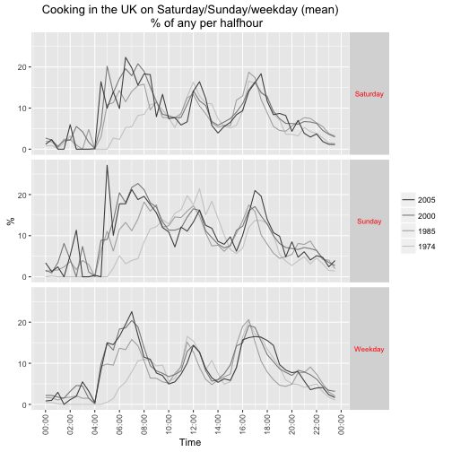
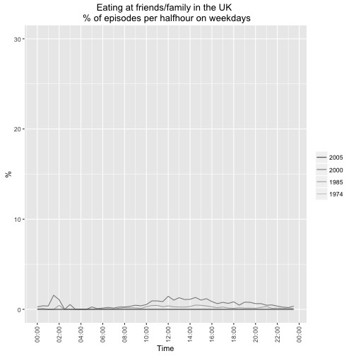
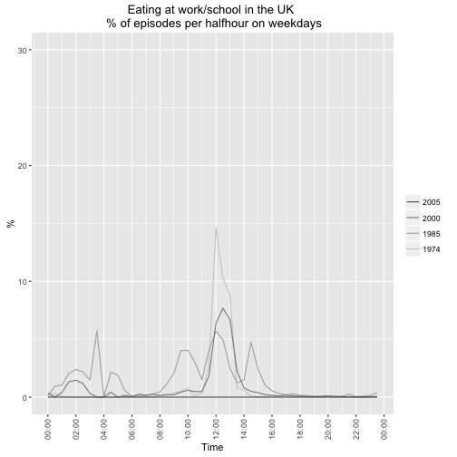
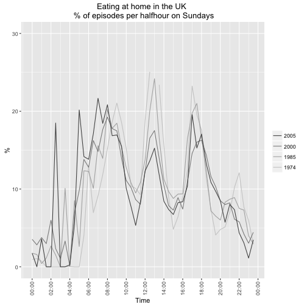
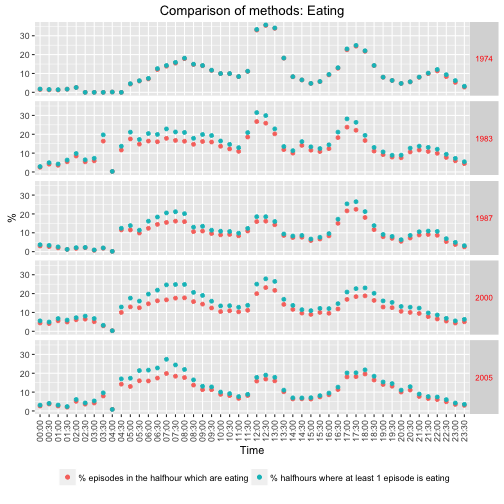

\pagebreak

Abstract (original)

Aggregate energy demand follows strong repetitive patterns on multiple scales (day, week, seasons), due to social rhythms coordinating the synchronicity of consuming practices. These patterns are not only related to natural cycles that remain unchanged, but also to social structures and technology, that change over the years and across different geographical areas.
How do these changes and regional differences affect energy demand rhythms? Answering this question, would improve our understanding of demand flexibility and possible future evolutions.

In this research we study the energy footprint of practices which are widely shared, highly regular, and key markers of the social organisation: eating practices. Different types of meals and food preparation are described based on the quantitative data collected by the means of Time Use Surveys in France and in the United Kingdom. These practices are defined in terms of time, durations, primary, secondary and surrounding activities, participants, and places. The distribution of these practices are studied across several time scales (week days, seasons, and decades from 1974 to 2010) and areas (UK, France and French regions). The temporal and spatial variations of eating practices can then be compared with the energy demand measured by the power grids or in specific campaigns, and varying along the same axes. This comparison reveals how parts of the energy demand dynamic are related to specific practices and their synchronisation. Finally, the mechanism of this coevolution can be partly interpreted in the light of wider social and technical changes depicted in socio-economic and demographic series (employment structure, food consumption, home equipment).

\pagebreak


```
## [1] "# Setting up R environment"
```

```
## [1] "Loading required packages:"
```

```
## [1] "ggplot2"    "data.table" "knitr"      "survey"
```

```
## [[1]]
## [1] TRUE
## 
## [[2]]
## [1] TRUE
## 
## [[3]]
## [1] TRUE
## 
## [[4]]
## [1] TRUE
```

\pagebreak

# Introduction
Discussion of temporal nature of electricity demand, interest in peaks (reasons for this) and the ability to shift in general.

Recent work (DECC HES?) has highlighted the role of cooking (and subequently eating) in generating demand for electricity during the evening peak period (give times).

At the same time recent work (Southerton et al) has shown how the habits and practices of eating have changed over time in the UK anbd Spain. Although this work only provides an analysis of the duration of acts (episodes) it provides evidence of the ongoing evolution of eating habits which may have implications for cooking and thus for electricity/energy demand.

It is possible that 're-arranging' cooking habits may be one way to reduce the problematic evening peak electricity demand. However without a more detailed analysis of what kinds of eating (and especially cooking) are already changing and of the variation in cooking practices across the population, we have little idea where to start.

Digression on time use as a footprint/proxy for practices?

This paper uses nationally representative time use diary data form the United Kingdom and France to compare and contrast the changing timing of cooking and eating in each country over the last 30 years. It then uses the most recent data to analyse and comapre the social and spatial variation in current eating practices in each country. Finally the paper provides preliminary analysis of French regional residential electricity consumption data which highlights the role of regional variation in cooking practices. The paper concludes with a discussion of the implications of the results for electricity demand in the UK and France and outlines directions for future research

# Cooking, Eating and Energy
Here we need to talk about the changing nature of cooking & eating from the literature (if there is any) - quant (e.g. Southerton) & qual (e.g. Warde).

Need then to link it to energy consumption - in UK gas & electricity used for cooking, in France = electricity (mostly, but LPG?).

More detailed discussion of the problem of peak demand? - expensive/dirty generation?

 * energy implication of different preparations : cooking/not cooking, in different places, with different appliances
 * giving time : synchronising a number of other energy demanding practices -> peaks
	
 We then need to explain here how we come to discuss these meal types:

 * weekday lunch 
 * weekday dinner
 * sunday lunch
 
Should this come after a general exploration of the data? So that we can look at the timings and then explain why we concentrate on these 'practices'?

# Data and Methods
A relatively brief introduction to the time use diary data for each country:

 * years & sources
 * key collection/diary features
 * categories of activities & any coding issues/missing attributes

Discussion of stats tools used. For UK, R and in particular:

 * base R - for the basics [@baseR]
 * data.table - for fast (big) data handling [@data.table]
 * ggplot2 - for slick grpahics [@ggplot2]
 * survey - for weighted survey analysis [@survey]
 * knitr - to create this document [@knitr]
 
## United Kingdom (MTUS)


```
## 
Read 46.9% of 1364047 rows
Read 89.4% of 1364047 rows
Read 1364047 rows and 17 (of 17) columns from 0.299 GB file in 00:00:04
```


```
##            ba_weekday
## r_dow       Saturday Sunday Weekday
##   Monday           0      0  177300
##   Tuesday          0      0  179170
##   Wednesday        0      0  169684
##   Thursday         0      0  174795
##   Friday           0      0  171673
##   Saturday    233789      0       0
##   Sunday           0 229471       0
```


Key codes in the MTUS:

 * meals at work or school = 5 (not available in all surveys)
 * meals or snacks in other places = 6
 * food preparation, cooking = 18
 * restaurant, cafe, bar, pub = 39 (but may not be eating?!)
 * out with friends could be eating = 48 (but check location as might also be at home)
 * eloc = location
 
Mention pooling 1983/4 & 1987 to form one '12 month' survey ref MTUS userguide p13

Mention not using 1995 as it was only collected in May (and location poorly recorded

Report some basic (unweighted) descriptive statsitics of the sample we will use. 


|        | 1974| 1985| 2000| 2005| NA|
|:-------|----:|----:|----:|----:|--:|
|(16,25] |  493|  496| 1058|  384|  0|
|(25,35] |  552|  737| 1675|  798|  0|
|(35,45] |  462|  612| 1732|  911|  0|
|(45,55] |  527|  507| 1630|  769|  0|
|(55,65] |  317|  356| 1133|  812|  0|
|(65,75] |  180|  168|  927|  633|  0|
|(75,85] |   54|   60|  533|  547|  0|
|NA      |   13|    0|    0|    0|  0|


|      | 1974| 1985| 2000| 2005| NA|
|:-----|----:|----:|----:|----:|--:|
|Man   | 1239| 1291| 3935| 2185|  0|
|Woman | 1359| 1645| 4753| 2669|  0|
|NA    |    0|    0|    0|    0|  0|

Finally we are also interested in trends in the location of both cooking and eating as this may also have implications for the nature of energy demand. The following table reports the weighted count of episodes by location and shows extent to which location of episodes is known in the different surveys.


```
##                 ba_survey.x   1974   1985   2000   2005
## ba_eloc                                                
## Family/friends                   0  18250  18407      0
## Home                        223925 356642 359719  58986
## Out (somewhere)              65238  85804 105989  26024
## Unknown                        145     26    370   6199
## Work or school               15768  36923  19356   4584
```

Clearly we are unable to tell if the episode location was at family/friends in any year except 1985 and 2000 whilst a large number are unkown in 2005 when location was poorly coded. 

### Cooking and eating episodes

Both cooking and eating could have been reported as main and secondary acts in all surveys except 1995 when secondary activities were not collected. For cooking we can see from the table below that the reporting of cooking was roughly constant over time but as a secondary act was low (0.5 to 2 %) in most surveys. As it is never clear whether secondary activities are simply rare, under-reported or not completed due to respondent burden (XX reference XX) in the remainder of the chapter we will focus on cooking as a main activity only.


| Survey| Main (% all episodes)| 2.5%| 97.5%| Secondary (% all episodes)| 2.5%| 97.5%|
|------:|---------------------:|----:|-----:|--------------------------:|----:|-----:|
|   1974|                  8.13| 7.99|  8.27|                       1.19| 1.14|  1.24|
|   1985|                  7.54| 7.45|  7.64|                       1.41| 1.37|  1.45|
|   2000|                  8.13| 8.02|  8.23|                       0.47| 0.45|  0.50|
|   2005|                  8.57| 8.36|  8.77|                       0.49| 0.43|  0.55|

Similarly, the reporting of eating is also faily constant over time and was reported in between one and four percent of secondary activity episodes. As above, due to uncertainties over the intepretation of secondary activities we will focus on eating as a main activity only in the remainder of the chapter


| Survey| Main (% all episodes)|  2.5%| 97.5%| Secondary (% all episodes)| 2.5%| 97.5%|
|------:|---------------------:|-----:|-----:|--------------------------:|----:|-----:|
|   1974|                 12.51| 12.41| 12.62|                       3.30| 3.22|  3.38|
|   1985|                 11.98| 11.89| 12.08|                       3.95| 3.88|  4.01|
|   2000|                 12.70| 12.59| 12.81|                       3.60| 3.52|  3.68|
|   2005|                 11.23| 11.05| 11.41|                       0.99| 0.91|  1.07|

## France (MTUS)

 * 1986 - 5 minutes resolution
 * 1998 - 10 minutes resolution
 * 2010 - 10 minutes resolution

...

Brief discussion of how we code weekday lunch, weekday dinner and sunday lunch in the French data

# The changing temporality of cooking and eating in the UK and France

Here we use the MTUS (UK) and French data to look at change in cooking (& eating?) over the last 30 years through the lenses of the three meal type.

> Need to decide whether to use:
>  * % of episodes OR
>  * % of halfhours in which the activity was recorded at least once (= 'any in the  half hour' indicator) 
> I have tested the two approaches below and they seem to give similar results...?


## The distribution of cooking and eating as main activities

Having the established the overall distributions of eating and cooking and chosen to focus on these as main activities, the following table shows the weighted proportion of episodes which were reported as cooking as a main activity by men and women in each survey. In general women report a far higher percentage of episodes as cooking/food preparation than men although the ratio has equalised somewhat from 1:0.17 in 1974 to 1:0.65 by 2005.


|Sex   | Survey| % episodes|  2.5%| 97.5%|
|:-----|------:|----------:|-----:|-----:|
|Man   |   1974|       2.11|  2.01|  2.22|
|Woman |   1974|      12.35| 12.18| 12.52|
|Man   |   1985|       4.40|  4.28|  4.53|
|Woman |   1985|       9.65|  9.53|  9.77|
|Man   |   2000|       5.96|  5.81|  6.12|
|Woman |   2000|       9.71|  9.57|  9.85|
|Man   |   2005|       6.62|  6.33|  6.91|
|Woman |   2005|      10.16|  9.89| 10.43|

In comparison, eating is reported far more equally (see below) with both men and women consistently reporting eating as a main activity in between 11 and 14 percent of episodes.


|Sex   | Survey| % episodes|  2.5%| 97.5%|
|:-----|------:|----------:|-----:|-----:|
|Man   |   1974|      14.05| 13.89| 14.22|
|Woman |   1974|      11.43| 11.30| 11.56|
|Man   |   1985|      12.90| 12.74| 13.05|
|Woman |   1985|      11.37| 11.25| 11.49|
|Man   |   2000|      13.68| 13.51| 13.84|
|Woman |   2000|      11.99| 11.85| 12.12|
|Man   |   2005|      11.48| 11.19| 11.76|
|Woman |   2005|      11.03| 10.79| 11.26|

However as the introduction to this chapter explained, the concern here is less with gender inequalities per se but more with the porentially changing temporal distronution of cooking and eating and the role that gendered norms may play. The following charts show the weighted distribution of cooking as a main activity across time of day and day of the week for the different surveys for all adults.

The first chart shows the results using the '% of episodes' recorded as cooking in each half hour whilst the second shows the results using the 'any in the half hour' indicator. We do not see substantial differences between the charts although the 'any in the half hour' indicator appears to underestimate differences due to the suppression of multiple episodes in the later surveys.




Overall we can observe more reported early morning weekday food preparation on weekdays in later years compared to 1974 and less at weekday lunch times. Food preparation also appears to have shifted to later in the day by 2005. The same ealry morning shifts are also seen on Saturdays and Sundays but the most notable weekend change is the reduction in lunchtime food preparation on Sundays with a shift towards the evening peak period (17:00 - 18:00).

The following charts show the distribution of eating across time of day and day of the week for the different surveys. Again the first chart shows the % of episodes recorded as eating whilst the second uses the 'any in the  half hour' indicator. Again we do not see substantial differences although as before the suppression of multiple episodes means that the apparebnt magnitude of change over time is (correctly?) reduced.

XX On this basis I am inclined to think that the 'any in the  half hour' indicator should be preferred? See also further comparisons in the Annex Section 8.2 XX


As with cooking, there have been notable changes in the temporal pattern of eating in the UK over the survey years. There has been an increase in early morning eating on all days but especially on weekdays (earlier brieakfast) and a decline in lunchtime eating on all days again especially on weekdays. Weekday eating in 2005 carried on later into the evening compared to earlier years and this was also the case on weekends with a notable reduction in the prevalence of sunday lunchtime eating.

XX Brief discussion of our consequential interest in patterns of weekday lunch, weekday dinner and sunday lunch and discussion of how we code them in the MTUS: XX

 * Weekday lunch is coded as eating between 12:00 and 14:00 at any location on a week day
 * Dinner is coded as any eating 17:00 - 22:00
 * Sunday lunch is coded as any eating between 12:00 and 15:00 on Sundays


The following tables summarise the prevalence of these 'eating practices' in the different UK surveys.


| Survey| % episodes| 2.5%| 97.5%|
|------:|----------:|----:|-----:|
|   1974|       2.77| 2.72|  2.83|
|   1985|       1.67| 1.64|  1.71|
|   2000|       1.98| 1.94|  2.02|
|   2005|       1.25| 1.19|  1.32|


| Survey| % episodes| 2.5%| 97.5%|
|------:|----------:|----:|-----:|
|   1974|       3.66| 3.61|  3.71|
|   1985|       3.60| 3.55|  3.64|
|   2000|       4.02| 3.97|  4.08|
|   2005|       3.76| 3.67|  3.86|


| Survey| % episodes| 2.5%| 97.5%|
|------:|----------:|----:|-----:|
|   1974|       0.59| 0.56|  0.62|
|   1985|       0.49| 0.47|  0.52|
|   2000|       0.51| 0.49|  0.53|
|   2005|       0.37| 0.33|  0.41|


## Week-day eating
		- Contemporary : timing, location, participants, seasons, who cooks (content can change depending on the relevance for this type of meal)
		- What changed in history -> energy implications
		- What varies between regions -> energy implications







NB: eating out could include travelling.

## Dinner
		- Contemporary : timing, location, participants, seasons, who cooks
		- What changed in history -> energy implications
		- What varies between regions -> energy implications

## Sunday meals
		- Contemporary : timing, location, participants, seasons, who cooks
		- What changed in history -> energy implications
		- What varies between regions -> energy implications





 
# Discussion
Draw together the threads of the results to discuss:

 * Main eating daily structure and synchronisation: giving time
 * Energy demand location: home, tertiary, industry
 * Employment, gender roles: how other practices change and constrain
 
# Acknowledgements
This work was funded by RCUK through the End User Energy Demand Centres Programme via the "DEMAND: Dynamics of Energy, Mobility and Demand" Centre:

 * http://www.demand.ac.uk 
 * http://gow.epsrc.ac.uk/NGBOViewGrant.aspx?GrantRef=EP/K011723/1
 
# Statistical annexes (if needed)
## MTUS UK sample

MTUS activity codes collected per year.


```
##                                                 
##                                                   1974  1985  2000  2005
##   adult care                                         0  1237  1235   301
##   art or music                                       0   682   634     0
##   attend sporting event                            173   352   431     0
##   child/adult care travel                         3275  5542  4528   996
##   cinema, theatre, opera, concert                  182   284   394   179
##   cleaning                                       13082 12694 15158  3032
##   computer games                                     0   142   825     0
##   consume other services                             0  1482  1119     0
##   consume personal care services                   622  1248   974     0
##   conversation (in person, phone)                 3855 12327  9047  1032
##   correspondence (not e-mail)                        0  1773   622     0
##   cycling                                            0    53   255    88
##   e-mail, surf internet, computing                   0   100  2252   601
##   education travel                                 175   646   602     0
##   food preparation, cooking                      24452 35968 37889  8653
##   games (social & solitary)/other in-home social     0  1720  2029     0
##   gardening/pick mushrooms                        1956  2589  3863     0
##   general indoor leisure                          2645   651     1   648
##   general out-of-home leisure                     1619   443   316     0
##   general sport or exercise                        494  1494  2129   507
##   homework                                         102   880   472   100
##   imputed personal or household care              2622  5273  1287    10
##   imputed sleep                                    487    39    54    25
##   imputed time away from home                      244   220   379    27
##   knit, crafts or hobbies                         1969  2769  1367  1098
##   laundry, ironing, clothing repair               1236  8078 10003  1376
##   leisure & other education or training            109   259   375    51
##   listen to music or other audio content           655   962  1069     0
##   listen to radio                                 2272  2110  2347     0
##   look for work                                      0   394    82     0
##   maintain home/vehicle, including collect fuel   3161  4389  5414  1080
##   meals at work or school                         2519  4540  2455     0
##   meals or snacks in other places                35370 52147 56228 11038
##   no activity, imputed or recorded transport       499     2   114     0
##   no recorded activity                             145  5168  3937    80
##   other domestic work                             2751  9093  8961     0
##   other outside recreation                         564   174   491     0
##   other public event, venue                        300   250   789     0
##   other time at workplace                           59    31   217     0
##   other travel                                   12674 13599 16373  5997
##   paid work at home                                813  1746  1677   625
##   paid work-main job (not at home)               13031 22042  9194  4478
##   party, social event, gambling                    987  1857   830     0
##   pet care (not walk dog)                          739  2925  3640  1090
##   physical, medical child care                    4024 12762 11177  2883
##   purchase goods                                  6187  9793 10188  2540
##   read                                            6818 13457 13625  2335
##   read to, talk or play with child                1154  2779  4551     0
##   receive or visit friends                        9392 12522 14475  3832
##   regular schooling, education                     217   746   341   117
##   relax, think, do nothing                       23515  8891 11290  4200
##   restaurant, café, bar, pub                      1912  4865  3028  2136
##   second or other job not at home                  124   122    99     0
##   set table, wash/put away dishes                    0 15317 14522     0
##   shop, person/hhld care travel                   3052  8268 16032  2456
##   sleep and naps                                 40316 41077 36264 10051
##   supervise, accompany, other child care             0  1477   704     0
##   teach, help with homework                          0   244   524     0
##   travel as a part of work                         351   606    65     0
##   travel to/from work                            14219 14296 10717  2435
##   unpaid work to generate household income           0    43     0     0
##   voluntary, civic, organisational act             448  2162  4558   206
##   voluntary/civic/religious travel                   0   944  3858     0
##   walk dogs                                          0  1231  2743     0
##   walking                                         1768  2562  7020  2149
##   wash, dress, care for self                     27995 51442 38498  8709
##   watch TV, video, DVD, streamed film            23919 39912 45025  8640
##   work breaks                                        0  7130  1494     0
##   worship and religion                             337  1074  1308   235
```

MTUS episodes per month by year


|          |   1974|   1985|  2000|  2005|
|:---------|------:|------:|-----:|-----:|
|January   |      0|  83303| 33715|     0|
|February  | 129080|  17762| 38166|     0|
|March     |  49613|  80533| 30790| 31178|
|April     |      0| 151098| 33372|     0|
|May       |      0|  32416| 44442|     0|
|June      |      0|   1304| 39563| 23198|
|July      |      0|      0| 55426|     0|
|August    |  96472|      0| 54732|     0|
|September |  26421|    257| 44863| 22144|
|October   |      0|      0| 33098|     0|
|November  |      0| 101961| 34559| 19516|
|December  |      0|   5462| 21438|     0|

MTUS episodes per season by year

|       |   1974|   1985|   2000|  2005|
|:------|------:|------:|------:|-----:|
|Autumn |  26421| 102218| 112520| 41660|
|Spring |  49613| 264047| 108604| 31178|
|Summer |  96472|   1304| 149721| 23198|
|Winter | 129080| 106527|  93319|     0|


MTUS episode locations per year


|                       |   1974|   1985|   2000|  2005|
|:----------------------|------:|------:|------:|-----:|
|at another’s home      |      0|  17430|  19109|     0|
|at own home            | 220990| 340883| 331560| 60529|
|at place of worship    |    337|    833|    768|     0|
|at restaurant, bar etc |   1700|   6095|   6124|  2499|
|at school              |    326|   1023|    527|   104|
|at services or shops   |   6787|  13011|  13091|  2021|
|at workplace           |  15658|  33658|  13809|  4037|
|location unknown       |    142|     25|    348|  6163|
|other locations        |  19633|  13631|  12242|  6424|
|travelling             |  36013|  47507|  66586| 14259|


## Testing methods to analyse temporal distributions of cooking & eating episodes
In order to control for the potentially different levels of reporting due to the different diary slot durations, we could also calculate an indicator which is 1 if at least one epsiode in a
given half hour is reported to be the activity of interest and 0 otherwise. In the case of the 1974 data where the diary slot duration was 30 minutes there
will be no difference. However in the case of the other diaries where data was collected in slots of 15 minutes (1983, 1987) or 10 minutes (2000/1,
2005) duration, this will have the effect of increasing the apparent rate as the denominator is no longer the sum of all episodes in the half hour but the
(lower) number of half hours.

The tables below show the distribution of these indicators across years.


| ba_survey| Cooking (mean n episodes per halfhour)| Cooking (max episodes per hh)| Cooking (% 'at least 1')|
|---------:|--------------------------------------:|-----------------------------:|------------------------:|
|      1974|                                   0.08|                             1|                     8.39|
|      1985|                                   0.09|                             6|                     8.70|
|      2000|                                   0.11|                             3|                    10.12|
|      2005|                                   0.11|                             3|                    10.29|


| ba_survey| Eating (mean n episodes per halfhour)| Eating (max episodes per halfhour)| Eating (% 'at least 1')|
|---------:|-------------------------------------:|----------------------------------:|-----------------------:|
|      1974|                                  0.13|                                  2|                   12.99|
|      1985|                                  0.14|                                  4|                   14.12|
|      2000|                                  0.17|                                  3|                   15.73|
|      2005|                                  0.13|                                  3|                   13.20|

We would expect there to be a maximum count of 1 in 1974 (the diary slots were 30 minutes long) but higher in the later years (diary slots are shorter). There appear to be some half hours with a lot of episode 'churn' - where the maximum is greater than 4. The following stem and leaf plots show the frequency of multiple episodes of cooking or eating per half hour.

Cooking:

```
## 
##   The decimal point is at the |
## 
##   0 | 00000000000000000000000000000000000000000000000000000000000000000000+1007676
##   0 | 
##   1 | 00000000000000000000000000000000000000000000000000000000000000000000+96990
##   1 | 
##   2 | 00000000000000000000000000000000000000000000000000000000000000000000+4281
##   2 | 
##   3 | 00000000000000000000000000000000000000000000000000000000000000000000+293
##   3 | 
##   4 | 0000000000
##   4 | 
##   5 | 0
##   5 | 
##   6 | 0
```

Eating:

```
## 
##   The decimal point is 1 digit(s) to the left of the |
## 
##    0 | 00000000000000000000000000000000000000000000000000000000000000000000+951337
##    2 | 
##    4 | 
##    6 | 
##    8 | 
##   10 | 00000000000000000000000000000000000000000000000000000000000000000000+152259
##   12 | 
##   14 | 
##   16 | 
##   18 | 
##   20 | 00000000000000000000000000000000000000000000000000000000000000000000+5417
##   22 | 
##   24 | 
##   26 | 
##   28 | 
##   30 | 00000000000000000000000000000000000000000000000000000000000000000000+232
##   32 | 
##   34 | 
##   36 | 
##   38 | 
##   40 | 0000000
```

The stem plots suggest that these are extremely rare events and so can be discounted as affecting the indicator unduly.

In the rest of this section we explore the two different approaches to comparing temporal distirbutions. The first graph in each section simply shows the percentage of episodes in a given half hour that were reported as being the activity of interest.

This second graphs repeat the above analysis but instead uses the 'any in the half hour' indicator. In theory this should control for any affects of the shorter diary slots in the more recent diaries but it will, of course, treat (e.g.) 1 or 3 episodes within a half hour as equivalent.

### Cooking 
The following graph compares the results of these two methods for cooking.


As we can see (as expected) that the 'at least 1 in a given half hour' matches to the % episodes per half hour in 1974 (1/2 hour diary slots), is higher in the morning in 1983/1987 (15 minute slots), similar in 1995 (15 minute slots) and higher in the mornings in 2000 & 2005 (10 minute slots). The indicator does not appear to unduly affect the observed patterns although it may over-emphasise cooking done in shorter durations such as in the early morning. This may lead us to conclude that 'more' cooking is being done in the morning which is not the case since this indicator cannot measure 'levels' of an activity.

### Eating
And now we do the same for eating.



As for cooking, the 'at least once in a given half hour' indicator records slightly higher values than the % episodes indicator from 1983 onwards (but not 1995) and especially in the morning. The same cautions therefore apply.

***
__Meta:__
Analysis completed in: 12.197 seconds using [knitr](https://cran.r-project.org/package=knitr) in [RStudio](http://www.rstudio.com).

***
__Footnotes:__

# References
